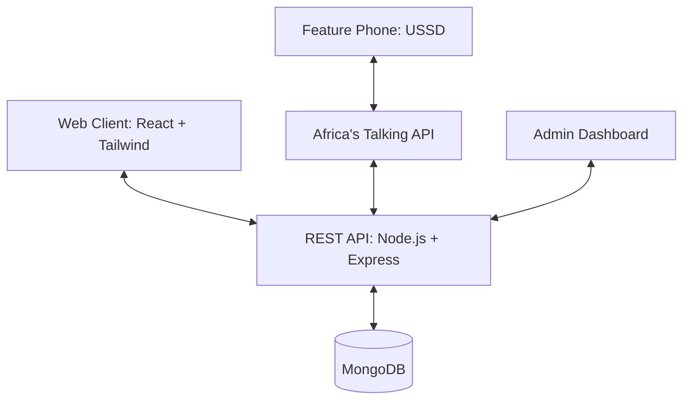

# 🛒 FreshCart


**FreshCart** is a comprehensive, production-ready full-stack e-commerce application built to bridge the gap between traditional e-commerce and accessibility. It provides a rich, modern web interface for smartphone and desktop users, while also seamlessly integrating a **USSD interface** (via Africa's Talking) for users with feature phones or limited internet connectivity.

This project consists of:
- 🎨 **Frontend:** A responsive, mobile-first UI built with React and Tailwind CSS.
- ⚙️ **Backend:** A robust REST API powered by Node.js, Express, and MongoDB, complete with JWT-based authentication and Role-Based Access Control (RBAC).

---

## 🚀 Features

### 🌐 User Web Experience
- **Product Catalog:** Browse, search, and filter products seamlessly.
- **Shopping Cart:** Add/remove items with real-time state management.
- **Order Placement:** Two-phase order processing ensuring exact stock management.
- **Responsive UI:** Tailored mobile-first aesthetic with fast load times.

### 📞 USSD Integration
- **Accessibility:** Browse products using basic feature phones (e.g., dialing `*123#`).
- **Cart & Orders:** Add items to cart and place orders entirely off-grid.
- **Real-time Sync:** USSD actions interact with the main backend in real-time.

### 🛠️ Admin Dashboard
- **User Management:** View, update, and manage access levels.
- **Product Management:** Complete CRUD operations for inventory.
- **Sales Tracking:** View transactions, order histories, and sales reports.

---

## 🧰 Tech Stack

**Frontend:**
- ⚛️ React (created with Vite)
- 🎨 Tailwind CSS
- 🧭 React Router (Client-side routing)

**Backend:**
- 🟢 Node.js & Express.js (CommonJS architecture)
- 🍃 MongoDB & Mongoose (Database & ORM)
- 🔐 JWT & bcryptjs (Authentication & Security)

**Integrations:**
- 🌍 Africa's Talking (for USSD functionality)

---

## 🏗️ Architecture



### Backend Highlights
- **Middleware Chain Pattern:** Secure flow from Router `→` Protect Middleware `→` AdminOnly Middleware `→` Controller.
- **Two-Phase Order Processing:** 
  1. *Verify* phase checks stock and product existence before proceeding (fail-fast).
  2. *Execute* phase deducts stock and stores the order.

---

## 📂 Project Structure

```text
freshcart/
│── frontend/             # React web application
│   ├── src/
│   │   ├── components/   # Reusable UI components
│   │   ├── pages/        # Main route views
│   │   ├── context/      # React contexts (e.g., CartContext)
│   ├── tailwind.config.js
│   └── vite.config.js
│
│── backend/              # Node.js REST API
│   ├── routes/           # API Endpoints
│   ├── controllers/      # Business logic controllers
│   ├── models/           # Mongoose schemas
│   ├── middleware/       # Auth & error handling
│   └── server.js         # Entry point
│
│── README.md             # This documentation
└── ...
```

---

## ⚙️ Installation & Setup

### Prerequisites
- Node.js (v16 or higher)
- MongoDB locally installed or a MongoDB Atlas URI

### 1. Clone the Repository
```bash
git clone https://github.com/Caleb-Kylib/freshcart.git
cd freshcart
```

### 2. Setup Backend Environment
```bash
cd backend
npm install
```

Create a `.env` file in the `backend/` directory:
```env
PORT=5000
MONGO_URI=your_mongodb_connection_string
JWT_SECRET=your_super_secret_jwt_key
AT_API_KEY=your_africas_talking_api_key
AT_USERNAME=your_africas_talking_username
```

Start the backend API:
```bash
npm run dev
```

### 3. Setup Frontend Environment
```bash
cd ../frontend
npm install
```
*(Ensure your API endpoint is correctly mapped, usually pointing to `http://localhost:5000/api`)*

Start the frontend server:
```bash
npm run dev
```

### 4. USSD Setup
1. Create an account on [Africa's Talking](https://africastalking.com/).
2. Setup a USSD service channel.
3. Configure your callback URL to point to your backend deployed address: `https://your-domain.com/api/ussd`.

---

## 🔌 Core API Endpoints

The backend exposes a highly structured RESTful API:

| Endpoint | Method | Access | Description |
|---|---|---|---|
| `/api/auth/register` | POST | Public | Register a new customer |
| `/api/auth/login` | POST | Public | Login and receive JWT |
| `/api/products` | GET | Public | Fetch products (supports pagination) |
| `/api/products/:id` | GET | Public | Fetch a single product |
| `/api/products` | POST | Admin | Add a new product to inventory |
| `/api/orders` | POST | User | Place a new order |
| `/api/orders` | GET | User | View own order history |
| `/api/orders/:id` | PUT | Admin | Update order status |

---

## 🛡️ Security Features
- **Passwords:** Hashed securely via `bcryptjs` (never stored in plain text).
- **Authentication:** Token-based using JWT, with 7-day expiration.
- **Authorization:** Granular roles (`customer` vs `admin`) enforced by middleware.
- **Validation:** Stringent input validation before controller execution to prevent NoSQL injection and corrupt data.

---

## 🔮 Future Improvements
- 💳 Integration with M-Pesa or alternative local payment gateways.
- 📦 Live order tracking via maps/telemetry.
- 🌍 Multi-language localization for web and USSD.
- 🐳 Docker containerization for automated deployments.

---

## 🤝 Contributing
Contributions are more than welcome!
1. Fork the project.
2. Create your Feature Branch (`git checkout -b feature/AmazingFeature`).
3. Commit your Changes (`git commit -m 'Add some AmazingFeature'`).
4. Push to the Branch (`git push origin feature/AmazingFeature`).
5. Open a Pull Request.

---

## 📄 License & Author

- **License:** MIT License
- **Author:** [Caleb Murero (Caleb-Kylib)](https://github.com/Caleb-Kylib)

> **Support:** If you found this project helpful, please give it a ⭐ on GitHub!